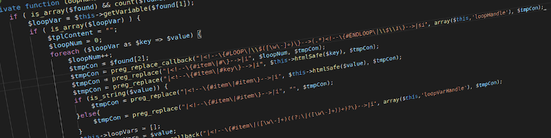

# Qawalib

<sub>[Qawalib v0.1.3 (Beta)]</sub>

Qawalib is a light and powerful Template Engine for PHP.

`NOTE:` This Class is still in Beta release. Please don't use this release in a production system.



## Install

Simply download the class `qawalib.class.php` to your application directory, then include the class in your code.

```php
<?php

include "qawalib.class.php";

?>
```

## Example

```php
include "qawalib.class.php";

$tp = new Qawalib();

$tp->setVerbose(4);
$tp->setTheme('default');
$tp->setLang('en');

$tp->setVariable("title", 'Page Title');
$tp->setVariable("title", 'عنوان الصفحة', 'ar');

$tp->setVariable("UserData", [
    [
        "id" => '1',
        "name" => "Ayoob",
        "email" => "name@example.com"
    ],
    [
        "id" => '2',
        "name" => "Name",
        "email" => "user@example.com"
    ]
]);

$tp->setVariable("UserData", [
    [
        "id" => '1',
        "name" => "ايوب",
        "email" => "name@example.com"
    ],
    [
        "id" => '2',
        "name" => "الاسم",
        "email" => "user@example.com"
    ]
], 'ar');


$tp->render('header');
$tp->render('sidebar');
$tp->render('content');

$tp->printTemplate("main");
```

Full documentation on how to use the class will be published soon

## License - GPLv3

Copyright (C) 2022  Ayoob Ali

This program is free software: you can redistribute it and/or modify it under the terms of the GNU General Public License as published by the Free Software Foundation, either version 3 of the License, or (at your option) any later version.

This program is distributed in the hope that it will be useful, but WITHOUT ANY WARRANTY; without even the implied warranty of MERCHANTABILITY or FITNESS FOR A PARTICULAR PURPOSE.  See the GNU General Public License for more details.

You should have received a copy of the GNU General Public License along with this program. If not, see <https://www.gnu.org/licenses/>

## Change Log

[2022-04-10] v0.1.3 (Beta):

- Added the template/theme information to the private variables (used with `<!--{$__fullPath}-->`, `<!--{$__language}-->`, etc...)

[2022-02-28] v0.1.2 (Beta):

- Added include function to include template from another template file.
- Added example file on how to use the class.
- Added the ability to render a template without printing it.

[2022-02-25] v0.1.0 (Beta):

- First Beta Release.
